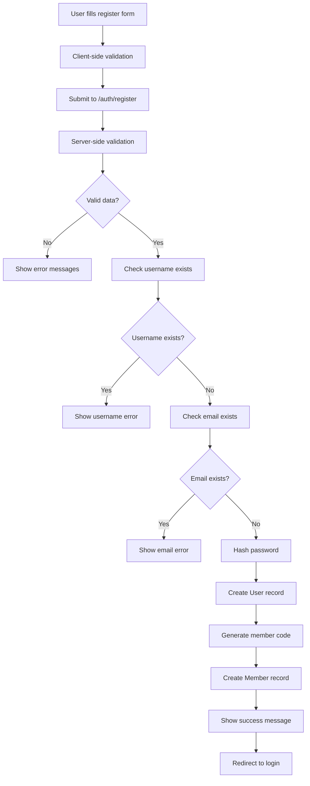
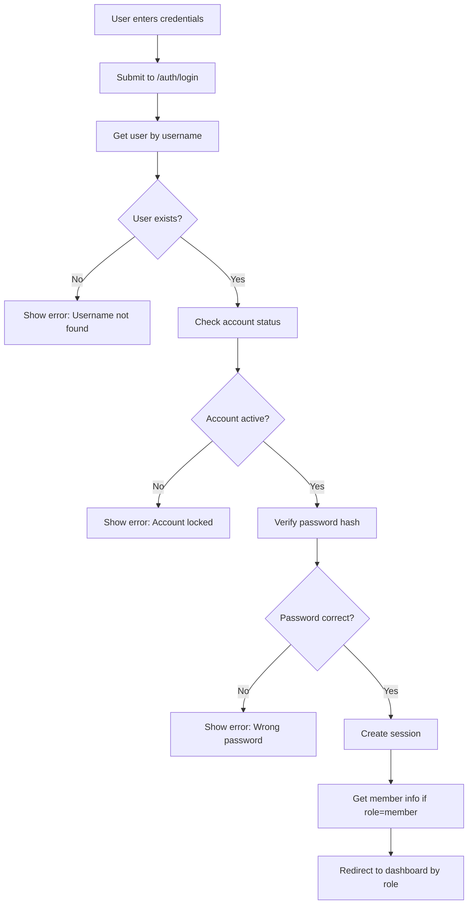

# Hướng Dẫn Authentication System - Gym Management

## 🎯 Tổng Quan

Hệ thống authentication hoàn chỉnh cho Gym Management System với:
- **Database 3NF** chuẩn cho authentication và member management
- **AuthController servlet** xử lý login/register/logout
- **Password hashing** với SHA-256 + salt
- **Session management** với role-based redirect
- **UI/UX hiện đại** với Bootstrap 5 và validation

## 📁 Cấu Trúc Files

```
src/
├── main/
│   ├── java/
│   │   ├── controller/
│   │   │   └── AuthController.java          ✅ Servlet xử lý auth
│   │   ├── util/
│   │   │   ├── PasswordUtil.java            ✅ Password hashing
│   │   │   └── SessionUtil.java             ✅ Session management
│   │   ├── DAO/
│   │   │   ├── IUserDAO.java                ✅ User interface
│   │   │   └── UserDAO.java                 ✅ User implementation
│   │   └── model/
│   │       └── User.java                    ✅ User model (updated)
│   └── webapp/
│       └── views/
│           ├── login.jsp                    ✅ Login page
│           ├── register.jsp                 ✅ Register page
│           ├── admin/
│           │   └── dashboard.jsp            ✅ Admin dashboard
│           └── member/
│               └── dashboard.jsp            ✅ Member dashboard (existing)
├── database_schema_3NF.sql                  ✅ Database schema
└── AUTHENTICATION_GUIDE.md                  ✅ This guide
```

## 🗄️ Database Schema (3NF)

### Tables Chính

#### 1. **roles** - Vai trò trong hệ thống
```sql
CREATE TABLE roles (
    role_id INT PRIMARY KEY IDENTITY(1,1),
    role_name VARCHAR(50) NOT NULL UNIQUE,
    description NVARCHAR(255)
);
```

#### 2. **users** - Thông tin đăng nhập và cá nhân
```sql
CREATE TABLE users (
    user_id INT PRIMARY KEY IDENTITY(1,1),
    username VARCHAR(50) NOT NULL UNIQUE,
    password_hash VARCHAR(255) NOT NULL,  -- BCrypt hash
    email VARCHAR(100) NOT NULL UNIQUE,
    full_name NVARCHAR(100) NOT NULL,
    phone VARCHAR(20),
    date_of_birth DATE,
    gender VARCHAR(10),
    address NVARCHAR(255),
    avatar_url VARCHAR(255),
    role_id INT NOT NULL,
    status VARCHAR(20) DEFAULT 'active',
    last_login DATETIME,
    failed_login_attempts INT DEFAULT 0,
    account_locked_until DATETIME,
    created_at DATETIME DEFAULT GETDATE(),
    updated_at DATETIME DEFAULT GETDATE()
);
```

#### 3. **members** - Thông tin chi tiết thành viên
```sql
CREATE TABLE members (
    member_id INT PRIMARY KEY IDENTITY(1,1),
    user_id INT NOT NULL UNIQUE,
    member_code VARCHAR(20) NOT NULL UNIQUE,
    registration_date DATE DEFAULT CAST(GETDATE() AS DATE),
    height DECIMAL(5,2),
    weight DECIMAL(5,2),
    bmi DECIMAL(4,2),
    fitness_goal VARCHAR(50),
    membership_package_id INT,
    package_start_date DATE,
    package_end_date DATE,
    package_status VARCHAR(20) DEFAULT 'active',
    emergency_contact_name NVARCHAR(100),
    emergency_contact_phone VARCHAR(20),
    total_workout_sessions INT DEFAULT 0,
    current_streak INT DEFAULT 0,
    status VARCHAR(20) DEFAULT 'active'
);
```

### Stored Procedures

#### 1. **sp_authenticate_user** - Xác thực đăng nhập
```sql
EXEC sp_authenticate_user 
    @username = 'john_doe',
    @password_hash = 'hashed_password',
    @user_id = @output_user_id OUTPUT,
    @role_name = @output_role OUTPUT,
    @is_locked = @output_locked OUTPUT;
```

#### 2. **sp_register_member** - Đăng ký member mới
```sql
EXEC sp_register_member
    @username = 'new_user',
    @password_hash = 'hashed_password',
    @email = 'user@email.com',
    @full_name = N'Nguyễn Văn A',
    @user_id = @output_user_id OUTPUT,
    @member_id = @output_member_id OUTPUT,
    @member_code = @output_member_code OUTPUT,
    @error_message = @output_error OUTPUT;
```

## 🔐 Authentication Flow

### 1. **Registration Process**



### 2. **Login Process**



### 3. **Role-based Redirect**

| Role | Redirect URL |
|------|-------------|
| `admin` | `/views/admin/dashboard.jsp` |
| `manager` | `/views/admin/dashboard.jsp` |
| `coach` | `/views/coach/dashboard.jsp` |
| `member` | `/views/member/dashboard.jsp` |
| `other` | `/home.jsp` |

## 🛠️ Technical Implementation

### 1. **PasswordUtil.java** - Password Security

```java
// Hash password với salt
String hashedPassword = PasswordUtil.hashPassword("userPassword123");

// Verify password
boolean isValid = PasswordUtil.verifyPassword("userPassword123", storedHash);

// Check password strength
boolean isStrong = PasswordUtil.isPasswordStrong("MyStr0ng!Pass");
String message = PasswordUtil.getPasswordStrengthMessage("password");
```

**Features:**
- SHA-256 hashing với random salt
- Password strength validation
- Secure random salt generation
- Format: `salt:hash` (Base64 encoded)

### 2. **SessionUtil.java** - Session Management

```java
// Create session after login
SessionUtil.createUserSession(request, user);
SessionUtil.createUserSession(request, user, memberId, memberCode);

// Check login status
boolean isLoggedIn = SessionUtil.isLoggedIn(request);
Integer userId = SessionUtil.getUserId(request);
String role = SessionUtil.getRole(request);

// Role checking
boolean isAdmin = SessionUtil.isAdmin(request);
boolean isMember = SessionUtil.isMember(request);

// Logout
SessionUtil.invalidateSession(request);
```

**Session Attributes:**
- `userId` - ID của user
- `username` - Tên đăng nhập
- `fullName` - Họ tên
- `email` - Email
- `role` - Vai trò
- `avatarUrl` - URL avatar
- `memberId` - ID member (nếu là member)
- `memberCode` - Mã member (nếu là member)

### 3. **AuthController.java** - Servlet Logic

**URL Patterns:**
- `GET /auth/login` - Hiển thị trang login
- `POST /auth/login` - Xử lý đăng nhập
- `GET /auth/register` - Hiển thị trang đăng ký
- `POST /auth/register` - Xử lý đăng ký
- `GET /auth/logout` - Đăng xuất

**Key Methods:**
```java
// Login handling
private void handleLogin(HttpServletRequest request, HttpServletResponse response)

// Registration handling  
private void handleRegister(HttpServletRequest request, HttpServletResponse response)

// Role-based redirect
private void redirectToDashboard(HttpServletResponse response, String role, String contextPath)
```

## 🎨 UI/UX Features

### 1. **Login Page** (`/views/login.jsp`)

**Features:**
- Responsive design với Bootstrap 5
- Gradient background
- Form validation (client + server)
- Remember me checkbox
- Password visibility toggle
- Error/success message display
- Auto-focus on username field

**Form Fields:**
- Username (required, min 4 chars)
- Password (required, min 6 chars)
- Remember me checkbox

### 2. **Register Page** (`/views/register.jsp`)

**Features:**
- Multi-step form layout
- Real-time password strength indicator
- Client-side validation với Bootstrap
- Terms & conditions checkbox
- Responsive design

**Form Fields:**
- Username (required, min 4 chars, unique)
- Email (required, valid format, unique)
- Full Name (required, min 2 chars)
- Phone (optional)
- Date of Birth (optional)
- Gender (optional dropdown)
- Password (required, strong validation)
- Confirm Password (required, must match)
- Terms & Conditions (required checkbox)

### 3. **Admin Dashboard** (`/views/admin/dashboard.jsp`)

**Features:**
- Modern admin interface
- Statistics cards với hover effects
- Interactive charts (Chart.js)
- Recent activity feed
- Quick action buttons
- Responsive sidebar navigation
- Role-based content display

**Sections:**
- Welcome section với user info
- Statistics overview (members, revenue, etc.)
- Charts (member growth, package distribution)
- Recent activity timeline
- Quick action buttons

## 🔧 Setup Instructions

### 1. **Database Setup**

```sql
-- 1. Run the complete schema
-- Execute database_schema_3NF.sql

-- 2. Verify tables created
SELECT TABLE_NAME FROM INFORMATION_SCHEMA.TABLES WHERE TABLE_TYPE = 'BASE TABLE';

-- 3. Check default data
SELECT * FROM roles;
SELECT * FROM users WHERE username = 'admin';
```

### 2. **Web.xml Configuration**

```xml
<!-- Add to web.xml -->
<servlet>
    <servlet-name>AuthController</servlet-name>
    <servlet-class>controller.AuthController</servlet-class>
</servlet>
<servlet-mapping>
    <servlet-name>AuthController</servlet-name>
    <url-pattern>/auth/*</url-pattern>
</servlet-mapping>
```

### 3. **Dependencies** (pom.xml)

```xml
<dependencies>
    <!-- Servlet API -->
    <dependency>
        <groupId>jakarta.servlet</groupId>
        <artifactId>jakarta.servlet-api</artifactId>
        <version>6.0.0</version>
        <scope>provided</scope>
    </dependency>
    
    <!-- JSP API -->
    <dependency>
        <groupId>jakarta.servlet.jsp</groupId>
        <artifactId>jakarta.servlet.jsp-api</artifactId>
        <version>3.1.0</version>
        <scope>provided</scope>
    </dependency>
    
    <!-- JSTL -->
    <dependency>
        <groupId>jakarta.servlet.jsp.jstl</groupId>
        <artifactId>jakarta.servlet.jsp.jstl-api</artifactId>
        <version>2.0.0</version>
    </dependency>
    
    <!-- SQL Server JDBC -->
    <dependency>
        <groupId>com.microsoft.sqlserver</groupId>
        <artifactId>mssql-jdbc</artifactId>
        <version>12.4.2.jre11</version>
    </dependency>
</dependencies>
```

## 🚀 Usage Examples

### 1. **User Registration**

```javascript
// Client-side validation
document.getElementById('registerForm').addEventListener('submit', function(e) {
    const password = document.getElementById('password').value;
    const confirmPassword = document.getElementById('confirmPassword').value;
    
    if (password !== confirmPassword) {
        e.preventDefault();
        alert('Mật khẩu xác nhận không khớp');
    }
});
```

### 2. **Login Check in JSP**

```jsp
<%@ taglib prefix="c" uri="http://java.sun.com/jsp/jstl/core" %>

<c:if test="${empty sessionScope.userId}">
    <script>
        window.location.href = '${pageContext.request.contextPath}/auth/login';
    </script>
</c:if>

<c:if test="${sessionScope.role != 'admin'}">
    <script>
        alert('Bạn không có quyền truy cập trang này');
        window.location.href = '${pageContext.request.contextPath}/views/member/dashboard.jsp';
    </script>
</c:if>
```

### 3. **Session Management in Servlet**

```java
// Check if user is logged in
if (!SessionUtil.isLoggedIn(request)) {
    response.sendRedirect(request.getContextPath() + "/auth/login");
    return;
}

// Check specific role
if (!SessionUtil.isAdmin(request)) {
    response.sendError(HttpServletResponse.SC_FORBIDDEN);
    return;
}

// Get user info
Integer userId = SessionUtil.getUserId(request);
String username = SessionUtil.getUsername(request);
```

## 🔒 Security Features

### 1. **Password Security**
- SHA-256 hashing với random salt
- Password strength validation
- Secure random salt generation
- No plain text password storage

### 2. **Session Security**
- Session timeout (30 minutes)
- Secure session attributes
- Automatic session invalidation on logout
- Role-based access control

### 3. **Input Validation**
- Client-side validation (JavaScript)
- Server-side validation (Java)
- SQL injection prevention (PreparedStatement)
- XSS protection (JSP escaping)

### 4. **Account Security**
- Account lockout after failed attempts
- Email uniqueness validation
- Username uniqueness validation
- Account status checking

## 📊 Database Performance

### Indexes Created
```sql
-- User table indexes
CREATE INDEX IDX_users_username ON users(username);
CREATE INDEX IDX_users_email ON users(email);
CREATE INDEX IDX_users_role ON users(role_id);
CREATE INDEX IDX_users_status ON users(status);

-- Member table indexes  
CREATE INDEX IDX_members_user ON members(user_id);
CREATE INDEX IDX_members_code ON members(member_code);
CREATE INDEX IDX_members_package ON members(membership_package_id);
CREATE INDEX IDX_members_status ON members(status);
```

### Triggers
- Auto-update timestamps
- Auto-calculate BMI
- Account lockout management

## 🐛 Troubleshooting

### Common Issues

#### 1. **Login không thành công**
```java
// Check database connection
// Verify password hashing
// Check user status
// Validate session creation
```

#### 2. **Registration fails**
```java
// Check username/email uniqueness
// Validate password strength
// Verify database transaction
// Check member code generation
```

#### 3. **Session không persist**
```java
// Check session timeout settings
// Verify session attributes
// Check browser cookie settings
// Validate session invalidation logic
```

### Debug Steps

1. **Check logs** for SQL errors
2. **Verify database** connection
3. **Test password** hashing manually
4. **Check session** attributes
5. **Validate** form data

## 📈 Future Enhancements

### Planned Features
1. **Remember Me** functionality với secure cookies
2. **Password Reset** via email
3. **Two-Factor Authentication** (2FA)
4. **Account Lockout** policies
5. **Audit Logging** cho security events
6. **OAuth Integration** (Google, Facebook)
7. **CAPTCHA** cho registration
8. **Email Verification** cho new accounts

### Performance Optimizations
1. **Connection Pooling** cho database
2. **Caching** cho user sessions
3. **Rate Limiting** cho login attempts
4. **Database Indexing** optimization
5. **CDN** cho static assets

## 📚 API Reference

### AuthController Endpoints

| Method | URL | Description | Parameters |
|--------|-----|-------------|------------|
| GET | `/auth/login` | Show login page | None |
| POST | `/auth/login` | Process login | username, password, remember |
| GET | `/auth/register` | Show register page | None |
| POST | `/auth/register` | Process registration | username, password, email, fullName, etc. |
| GET | `/auth/logout` | Logout user | None |

### Session Attributes

| Attribute | Type | Description |
|-----------|------|-------------|
| `userId` | Integer | User ID |
| `username` | String | Username |
| `fullName` | String | Full name |
| `email` | String | Email address |
| `role` | String | User role |
| `avatarUrl` | String | Avatar URL |
| `memberId` | Integer | Member ID (if member) |
| `memberCode` | String | Member code (if member) |

## ✅ Testing Checklist

### Manual Testing
- [ ] User registration với valid data
- [ ] User registration với invalid data
- [ ] User login với correct credentials
- [ ] User login với wrong credentials
- [ ] Role-based redirect sau login
- [ ] Session persistence
- [ ] Logout functionality
- [ ] Password strength validation
- [ ] Form validation (client + server)
- [ ] Responsive design trên mobile

### Database Testing
- [ ] User creation trong database
- [ ] Member creation sau user creation
- [ ] Password hashing verification
- [ ] Session data storage
- [ ] Role assignment
- [ ] Account status updates

## 🎉 Conclusion

Hệ thống authentication đã được thiết kế và implement hoàn chỉnh với:

✅ **Database 3NF** chuẩn và tối ưu  
✅ **Security** mạnh mẽ với password hashing  
✅ **UI/UX** hiện đại và responsive  
✅ **Role-based** access control  
✅ **Session management** an toàn  
✅ **Validation** đầy đủ (client + server)  
✅ **Documentation** chi tiết  

Hệ thống sẵn sàng để deploy và sử dụng trong production! 🚀
